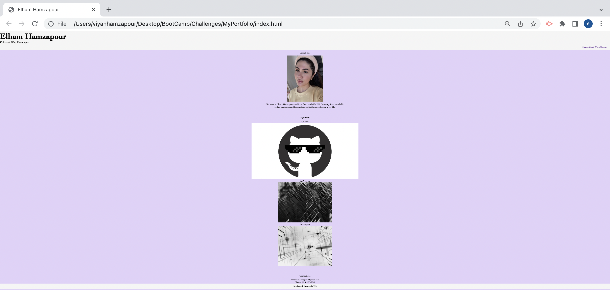

# MyPortfolio
My portfolio showcases my work, brief summary about me, and contact information 

## Table of Contents
* General Info
* Technologies Used
* Screenshot
* Project Status
* Link to Deployed Application

## General Information
* Navigation bar that will navigate each tab to its link 
* Images to work with working link
* Contact information for clients to reach the developer

## Technologies Used
* HTML
* CSS

## Screenshot

## Project Status
Project is: Complete

## Link to Deployed Application
https://ehamzapour.github.io/MyPortfolio/